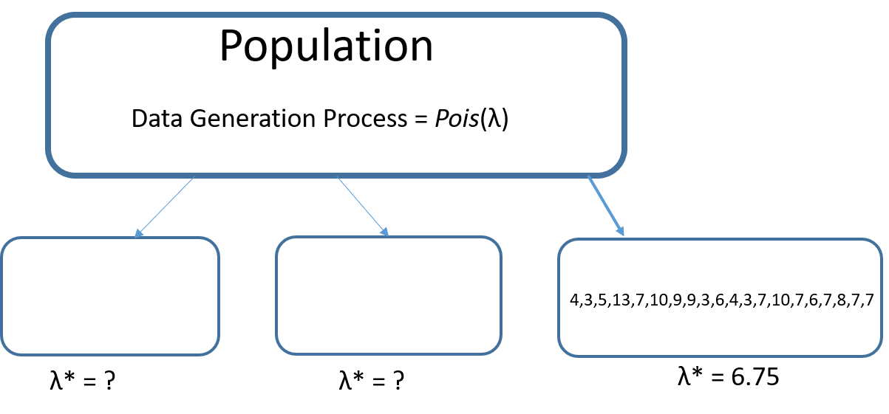

```{r setup, warning=FALSE,include=FALSE}
library(knitr)
knitr::opts_chunk$set(echo = TRUE)
results='markup' 
options(scipen = 999, digits = 4) #set to four decimal 

inline_hook <- function (x) {
  if (is.numeric(x)) {
    # ifelse does a vectorized comparison
    # If integer, print without decimal; otherwise print 4 places
    res <- ifelse(x == round(x),
      sprintf("%d", x),
      sprintf("%.4f", x)
    )
    paste(res, collapse = ", ")
  }
}
knit_hooks$set(inline = inline_hook)

```


# Load packages
```{r message=FALSE}
library(bbmle)
```

# Introduction

Supose we have a sample of data as follows. 

```{r}
x = c(4,3,5,13,7,10,9,9,3,6,4,3,7,10,7,6,7,8,7,7)
```

We believe that this sample comes from a population with the data generation
process that can be described by a Poisson distribution. This is depicted in the 
figure below. 


In **statistical estimation**, we want to ask the question: what is the  estimate of $\lambda$ that best explains the data that we observe? The most popular approach for estimation is called **maximum likelihood estimation**.

# Likelihood Principle

Our objective is to find the value of $\lambda$ that best explains the data we have. Let us start this quest with an initial value of 6 for $\lambda$. 

Notice that the first observation in our sample has a value of 4. If $\lambda$ is 6, what is the probability of finding a value of 4?

```{r}
x = c(4,3,5,13,7,10,9,9,3,6,4,3,7,10,7,6,7,8,7,7)
lam = 6
dpois(x = 4, lambda = lam)
```

The second observation has a value of 3. What is the probability of observing this?

```{r}
dpois(x = 3, lambda = lam)
```

Similarly, we can compute the probabilities of each of the values in the sample. 

```{r}
lam = 6
p = dpois(x = x, lambda = lam)
print(round(p,3))
```

Having computed the probabilities of individual observations, let us know compute the probability of observing the entire sample of data.

Let us introduce some notation first. Let $x_1, ...,x_n$ denote the sample 
observations and $P(x_1 | \lambda),...,P(x_n | \lambda)$ denote the corresponding 
probabilities for a given $\lambda$. If the observations are **independent**, then 
the probability of observing the entire sample is 
$$\prod_{i = 1}^{n} P(x_i | \lambda)$$

This is termed the likelihood function. 

$$L = \prod_{i = 1}^{n} P(x_i | \lambda)$$

The likelihood function as defined above invokes the **iid** assumption, which stands for independent and identically distributed observations.

Let us calculate the likelihood value for our sample with $\lambda = 6$. 

```{r}
lam = 6
p = dpois(x = x, lambda = lam)
L = prod(p)
L
```

You will notice that likelihood value is very small. Such low values are difficult to work with from a computational standpoint. It is more convenient to use the log of likelihood. 

$$LL = log( \prod_{i = 1}^{n} P(x_i | \lambda))$$

$$LL = log(P(x_i | \lambda),...P(x_n | \lambda))$$

$$LL = \sum_{i = 1}^{n} log(P(x_i | \lambda))$$

Let us compute the loglikelihood for our sample.

```{r}
lam = 6
p = dpois(x = x, lambda = lam)
LL = sum(log(p))
LL
```

Let us package this into a function. 

```{r}
LLpois = function(lam){
  p = dpois(x = x, lambda = lam)
  LL = sum(log(p))
  return(LL)
}
LLpois(5)
```

The **maximum likelihood principle** states that the best estimate of $\lambda$ is one that maximizes the likelihood of the observed sample. This makes sense because $L$ in essence is the joint probability of observing the entire sample of data. The best estimate of $\lambda$ is the one that maximizes $L$. Note that maximizing $L$ is equivalent to maximizing the loglikelihood $LL$. 

In this simple example, it can be shown mathematically that the maximum likelihood estimate of $\lambda$ is simply the sample average. 

```{r}
mean(x)
```


In more complicated settings, we may not be able to solve the optimization problem analytically. In such cases, we use numerical computational methods to get the maximum likelihood estimates. 


# Yet Another Distribution!

Based on our sample of data, the maximum likelihood estimate for $\lambda$ is 
6.75. 



What if you take another sample from the same population? A different sample drawn from the population could potentially yield a different estimate for $\lambda$. Let us create other samples using the bootstrapping approach and compute the estimate for each.

```{r}
set.seed(987654321)
paramdist = replicate(10000, mean(sample(x = x, replace = T)))
plot(density(paramdist))
```

What we have is called a **parameter distribution**. Let us compute the 95%
confidence interval and the standard deviation for this distribution. 

```{r}
sd(paramdist)
q2 = quantile(paramdist, c(.05/2,1-(.05/2)))
plot(density(paramdist))
abline(v = q2, col = "red")
paste("95% Confidence interval = ", "[",q2[1], q2[2],"]")
```

When you take a different sample, you will obviously get a different estimate. 
Based on the parameter distribution, we can say the following.

1. The maximum likelihood estimate is 6.75. This is also called the **point estimate**.   
2. We are 95% confident that the population value of $\lambda$ is between 5.6 and 
7.9.  
3. The standard deviation for the parameter distribution is 0.582. This is also called
the **standard error** of the parameter estimate. 

One final point to be made here is that in most cases, the parameter distribution 
is reasonably normal. 

# Optimizing Computationally

We will use the `bbmle` package to computationally optimize the likelihood function. 

The main function in the `bbmle` package that does the optimization is `mle2()`. The process is as follows.  

1. Create a function that computes the log likelihood value for a given set of parameters. The parameters are the inputs to the function. The output of the function should be the negative of the loglikelihood as most optimization routines attempt to minimize a function.  
2. Use the `mle2()` function to attempt to find the maximum likelihood parameter values. The basic
syntax is  

`mle2(minuslogl=function to minimize, start=list(“starting values of the
parameters”))`  

Let us estimate the parameter for the example we just did. 

```{r}
LLpois = function(lam){
  p = dpois(x = x, lambda = lam)
  LL = sum(log(p))
  return(-1*LL)
}

res1 = mle2(minuslogl = LLpois, start = list(lam = 10))
summary(res1)
```

You will notice that the results are the same as before (when we mathematically optimized likelihood). 

# Numeric Outcome

Read the `admission.csv` file. 

```{r}
admission <- read.csv("../../data/admission.csv")
head(admission)
```

Let us assume that the data generation process for the variable `GMAT` is normal. This is depicted in the figure.  We want to obtain the maximum likelihood estimates of the population mean and standard deviation. 


```{r}
LLnorm = function(mean1, standdev){
  p = dnorm(x = admission$GMAT, mean = mean1, sd = standdev)
  LL = sum(log(p))
  return(-1*LL)
}

res1 = mle2(minuslogl = LLnorm, start = list(mean1 = 500, standdev = 100))
summary(res1)
```

# Binary Outcome

We want to estimate the probability of `admit` based on the sample of data, as 
shown in the figure below. 


```{r warning=FALSE}
LLbinary = function(pi){
  p = ifelse(admission$De == "admit", pi, 1 - pi)
  LL = sum(log(p))
  return(-1*LL)
}

res1 = mle2(minuslogl = LLbinary, start = list(pi= .5))
summary(res1)
```

# A Few Cautionary Notes

* This may be a bit challenging for some students to grasp. The instructor may want to skip this and return to it if/when issues in coding are encountered by  students.

When using  computational methods to find the maximum likelihood values, 
you should be aware of two potential issues. 

1. Starting values.   
The function `mle2()` requires you to specify starting values for the parameters
to be optimized. For complicated likelihood functions, it is important to specify
good starting values so that the search for optimal values converges reasonably. As we will see in the next lesson, using starting values from a `baseline model` is a reasonable approach to take. We will explain the concept of a baseline model in the next lesson.   
2. Errors.   
In an attempt to get the optimal values of the parameters, optimization 
algorithms can potentially search in the entire domain of values from 
$-\infty$ to $\infty$. Sometimes this can be a problem and lead to an error. 
Below is an example.

```{r}
dpois(3,lambda = -10)
```

Obviously, the mean of a Poisson distribution cannot be negative, but the 
optimization algorithms may try negative values in their search to find the optimal 
value of $\lambda$. This may throw an error and cause the routine to fail. If this happens, the best way to deal with it is to place bounds on the parameter values.


It also turns out that the `bbmle` package supports several different methods for optimization (see [link](https://www.rdocumentation.org/packages/stats/versions/3.6.2/topics/optim)). The optimization method `L-BFGS-B` allows box constraints, that is each
variable can be given a lower and/or upper bound. We do so using the `lower` and `upper` commands in the function as shown in the example below.

`res = mle2(minuslogl = LLmeansd,`    
      `start = list(M=10,sigma=1),`    
      `lower=c(M=-Inf,sigma=0),`    
      `method = "L-BFGS-B")`    
