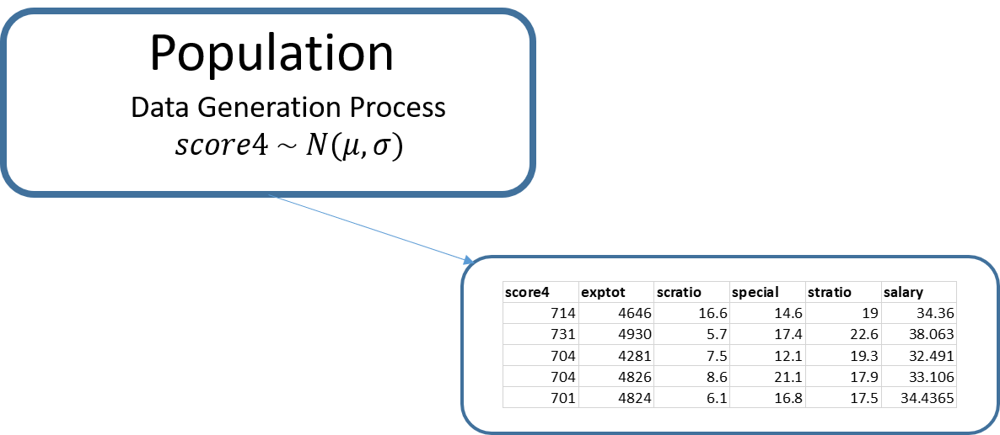
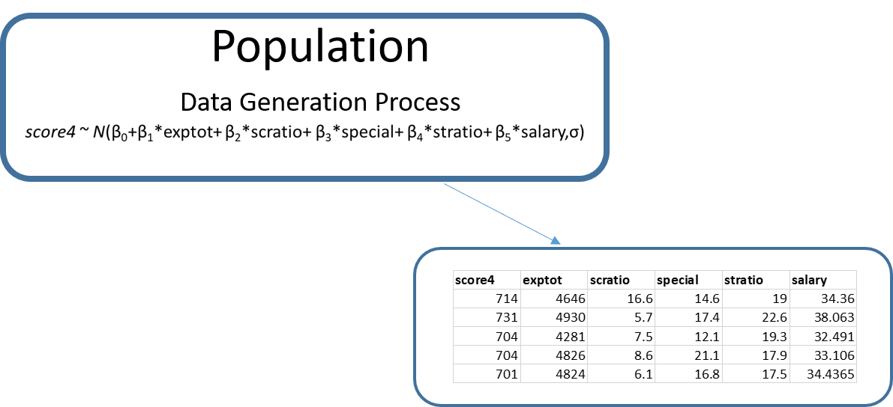
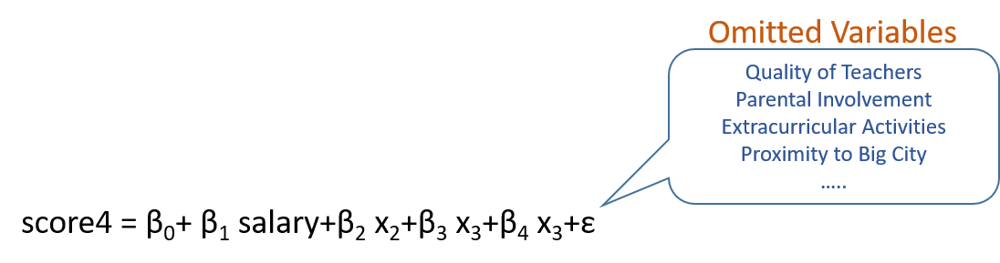
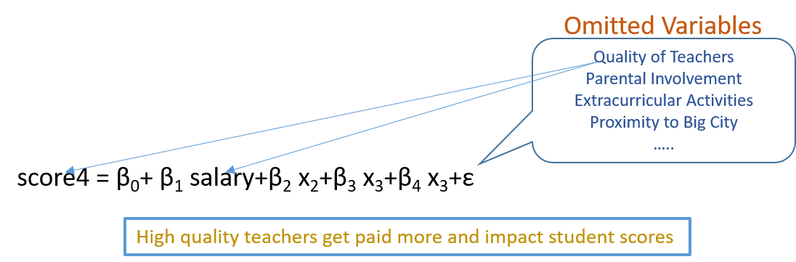
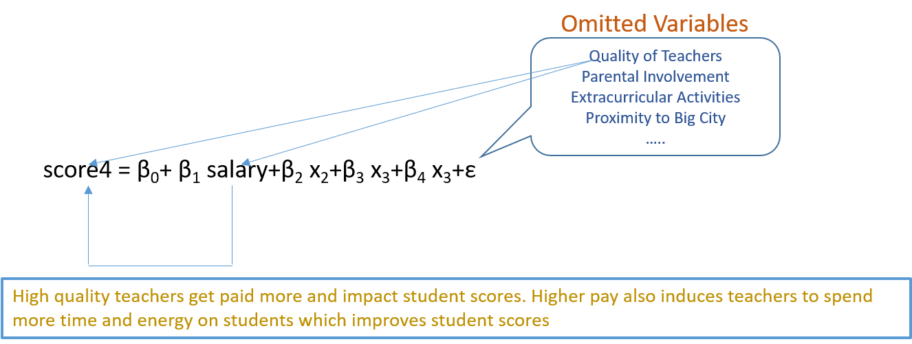
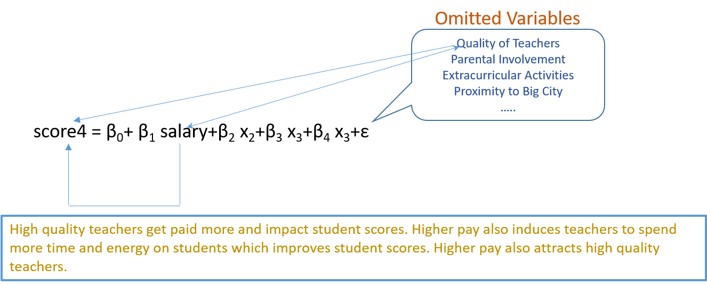

```{r setup, warning=FALSE,include=FALSE}
library(knitr)
knitr::opts_chunk$set(echo = TRUE)
results='markup' 
options(scipen = 999, digits = 4) #set to four decimal 

inline_hook <- function (x) {
  if (is.numeric(x)) {
    # ifelse does a vectorized comparison
    # If integer, print without decimal; otherwise print 4 places
    res <- ifelse(x == round(x),
      sprintf("%d", x),
      sprintf("%.4f", x)
    )
    paste(res, collapse = ", ")
  }
}
knit_hooks$set(inline = inline_hook)

```


# Load packages
```{r message=FALSE}
library(bbmle)
```

# Introduction

We explore linear regression models, one of the most widely used
modeling techniques in statistics. We will use a dataframe `MASchools` which has information about a number of school districts in the state of 
Massachusetts. 

```{r message=FALSE}
df = read.csv("../../data/MASchools.csv")
```

Our main variable of interest is $score4$, which is the score of fourth grade 
students. Along with this, we will work with a few other variables from this data frame. 

```{r}
df = df[,c(13,7,8,9,11,15)]
df[1:7,]
```

A brief explanation of the variables is provided below. 

Variable| Description
--------|-------------
score4|4th grade score (math + English + science)
exptot|Expenditures per pupil, total
scratio|Students per computer
special|Special education students (per cent)
stratio|Student-teacher ratio
salary|Average teacher salary
----------------------------------------

# Dealing with Missing Data  

You will notice that there are missing values in the data frame which 
are marked as NA. We want to remove these observations from our analysis. 
There is a function called `complete.cases()` which allows you to find rows that 
have no missing values. First, let us create a table to determine the number of complete rows. 

```{r}
round((colMeans(is.na(df)))*100,3)
```


```{r}
salarymean = mean(df$salary,na.rm = T)
salaryimputed = ifelse(is.na(df$salary),salarymean,df$salary)
salarymean
mean(salaryimputed)
sd(df$salary,na.rm = T)
sd(salaryimputed)
```


```{r}
table(complete.cases(df))
```

There are 34 rows that contain missing values. We will create and work with a new data frame that contains only complete observations. 

```{r}
df1 = df[complete.cases(df),]
table(complete.cases(df1))
```

Now the data is ready for analysis!

# Baseline Model

Our outcome of interest is the variable score4, which is numeric, and its 
data generation process is shown in the figure below. 



We will estimate the population parameters of score4. 

```{r warning=FALSE}
library(bbmle)
LLnorm = function(mean1, standdev){
  p = dnorm(x = df1$score4, mean = mean1, sd = standdev)
  LL = sum(log(p))
  return(-1*LL)
}

res1 = mle2(minuslogl = LLnorm, start = list(mean1 = 700, standdev = 50))
summary(res1)
```

Let us unpack and understand this a bit. Our estimation results show that 
$$ score4 \sim N(709,15.4)$$

we can write this as 

$$ score4 = 709 + N(0,15.4)$$

$$ score4 = 709 + \epsilon, \text{ } \epsilon \sim N(0,15.4)$$

The way to interpret the above is that our estimation or prediction for score4 
is 709 for any school district. Of course there is possibility for errors in 
prediction, and this error is normally distributed with a standard deviation of 
15.4. Why is there an error in our prediction? This is because there are a number
of variables which we do not have information about that impact the score
of fourth graders. These are our **omitted variables**. For example, these variables 
could be family income, extracurricular activities available in the district, parental 
involvement, quality of teachers, and so on. These represent **what we do not 
know**. The higher the standard deviation of the error term, the more we do not
know. From this perspective, it is good to develop models that lower the 
variance or standard deviation in the error term. 


Let us plot the errors in a graph below. 

```{r}
x = seq(1,nrow(df1))
plot(x = x, y = df1$score4)
abline(h = 709, col = "blue")
segments(x,709,x,df1$score4,col = "red")
```

Let us compute the sum of squared errors for all the observations. This is called 
**SST (sum of squares total)**. We will come back to this later. 

```{r}
SST = sum((df1$score4 - 709)^2)
SST
```

# Linear Regression Model 

In the baseline model, our estimation or prediction of score4 for every school 
district is the same at 709. Now suppose we believe that we can explain why some
school districts have higher scores and others have lower scores. The new, more
intelligent, data generation process we propose is the following. 



Let us write the code to estimate this data generation process. First, we will 
create the function to compute the loglikehood. 

```{r}
library(bbmle)
LLnorm = function(b0,b1,b2,b3,b4,b5, standdev){
  mean1 = b0 + b1*df1$exptot + b2*df1$scratio + b3*df1$special + b4*df1$stratio + b5*df1$salary
  p = dnorm(x = df1$score4, mean = mean1, sd = standdev)
  LL = sum(log(p))
  return(-1*LL)
}

```

Before we optimize, we need to set some starting values for all the parameters. 
A reasonable set of starting values can be obtained from the baseline model we 
did previously. With this, we write the code as:

```{r warning=FALSE}
res2 = mle2(minuslogl = LLnorm, 
            start = list(b0 = 709,b1 = 0,b2 = 0,b3=0,b4=0,b5=0,standdev = 15.4))
summary(res2)
```

We just estimated our first regression! 

## Understanding Regression Results

### Regression Equation

Our regression result is the following. 

$$ score4 = 714.8 -0.005 \times exptot - 0.108 \times scratio - 0.717 \times special - 2.65 \times stratio + 2.21 \times salary$$ 

Let us write out the estimation or prediction for each observation, both from 
our baseline model and from the regression model. We will also write out the error
from the regression equation. 

```{r}
coef(res2)
```


```{r}
df1$baseline = 709
df1$regression = as.matrix(df1[,2:6]) %*% coef(res2)[2:6] + coef(res2)[1]
df1$regerror = df1$score4 - df1$regression
round(df1[1:5,c(1,7,8,9)],3)
```

Let us plot the errors from the regression equation. 

```{r}
x = seq(1,nrow(df1))
plot(x = x, y = df1$regerror, col = "purple", pch = 19)
abline(h=0)
segments(x,df1$regerror,x,0,col = "red")
```

### Model Fit

If the regression model is better than the baseline model, then we expect the 
errors to be smaller. Similar to before, let us compute the sum of the squared
errors. This is called **SSE (sum of squares errors)**. 

```{r}
SSE = sum((df1$regression - df1$score4)^2)
SSE
```
Clearly, errors are lower than in the baseline model. Thus, the regression model 
is giving us a better approach to estimate score4. There is a measure called $R^2$ which is defined as 
$$R^2 = 1 - \frac{SSE}{SST}$$

The value for us is 

```{r}
Rsquare = 1 - (SSE/SST)
round(Rsquare,3)
```

$R^2$ is a measure of overall goodness of fit. When $R^2$ is 0, we know that 
SSE=SST, which means the regression model is the same as the unintelligent baseline 
model. When SSE = 0, which indicates that there are no errors in the regression, 
then we get an $R^2$ of 1. 

Another way to understand $R^2$ is by looking at the standard deviation (or equivalently, variance) of the error terms in the baseline and regression models. 

$$R^2 = 1 - \frac{\text {variance of error term in the regression model}}{\text {variance
of error term in the baseline model}}$$

Let us check this with the code. 

```{r}
varbaseline = 15.39563^2
varregression = 13.1042240^2
round(1 - (varregression/varbaseline),3)
```

$R^2$ is an indication of what proportion of the variation observed in the outcome
is being explained by the model. Our regression model is able to explain about 27.5% of the variation in score4. The purpose of building a good regression model is to lower the standard deviation of the error term from the baseline model as much as possible. 

### Marginal Effects

**Assuming all the assumptions of the regression model hold**, the coefficients
for each of the independent variables (these are the variables on the right-hand
side of the regression equation) are called the **marginal effects**. For example, 
a unit increase in salary is expected to increase score4 by 2.2096528. You have 
to be careful with this statement. We will have more to say about this soon. 

### Statistical Significance

Let us take a look at the regression result for the variable scratio. The estimated
value is -0.1083852 and the standard error is 0.3516757. As we discussed in the previous lesson, the point estimate based on the data is -0.1083852. The value of the coefficient in the population follows a normal distribution with a standard deviation of 0.3516757.  Let us plot this parameter distribution and compute the 95% confidence interval.

```{r}
m1 = -0.1083852
se1 = 0.3516757
curve(dnorm(x,mean = m1, sd = se1), from = -1, to = 1)
abline(v = m1)
qvalues = qnorm(p = c((.05/2), 1-(.05/2)))
qvalues
```

Since the 95% confidence interval [-1.959964,1.959964] contains 0, we cannot statistically rule out the possibility that the coefficient value is 0. This means that there is a possibility that scratio has no effect on the outcome. We term this 
**not statistically significant**. 

We can also compute a p value here similar to what we did earlier with statistical testing. 

```{r}
gap = abs(m1 - 0)
curve(dnorm(x,mean = m1, sd = se1), from = -1, to = 1)
abline(v = m1)
abline(v = m1 - gap, col = "blue")
abline(v = m1 + gap, col = "blue")
a = pnorm(q = m1 + gap, mean = m1, sd = se1)
b = pnorm(q = m1 - gap, mean = m1, sd = se1)
pval1 = 1 - (a - b)
pval1
```

The p value we just computed is exactly what the `mle2()` function produces. 
When the p value is small (typically less than 0.05), we say that the variable 
has a statistically significant impact on the outcome, and otherwise, not. 

Based on the results we obtained, we can conclude that all the variables except 
scratio has an effect on score4. Furthermore, all statistically significant variables except salary have a negative effect on score4. Interestingly, higher expenditure per pupil is associated with lower grade four scores. 

## Assumptions of the Regression Model

As you can imagine, regression models are very widely used. Many important decisions 
and policies are implemented based on regression studies. These actions and policies
entail expending significant time, energy, and resources based on the results of the regression analysis. Given the importance of this, before implementing or taking critical actions, it is important that you understand that the model you built satisfies all the key assumptions on which the model is built. Violations of these assumptions may provide misleading insights and put you down the wrong path in terms of actions taken. Let us take a look at some of the important assumptions. 

### Normality

A key assumption made is that error terms are normally distributed. Is this true in 
our case? We can check this easily. 

```{r}
plot(density(df1$regerror))
shapiro.test(x = df1$regerror)
```

The plot and the Shapiro-Wilk normality test confirm that the errors are reasonably
normally distributed. If you find significant deviations from normality, a good
approach to take is to reexamine the regression structure. This, for example, 
could be to transform the independent or dependent variables. 

### Homoscedasticity

The regression model assumes a constant standard deviation. This assumption means that the variance or standard deviation of the error term is not correlated to the dependent or outcome variable. In other words, we should not see the magnitude of errors varying with the values of the outcome. Let us take a look at this through a plot of predicted outcomes and the errors. 

```{r}
plot(df1$regression, df1$regerror)
abline(h = 0)
segments(df1$regression, 0, df1$regression, df1$regerror, col = "red")
```

Visually, there does not appear to be a violation of this assumption in our model. There are formal tests that you can conduct for check for **heteroscedasticity**. 

### Multicollinearity
Suppose we are interested in the effect of salary on score4. To place our focus on the effect of salary, let's express the regression equation as follows.

$$score4 = \beta_0+\beta_1 salary+\beta_2x_2+\beta_3x_3+\beta_4x_4+\epsilon$$
Take the first derivative with respect to salary

$$\frac{d(score4)}{d(salary)} = \beta_1 +\beta_2\frac{dx_2}{d(salary)}+
\beta_3\frac{dx_3}{d(salary)}+\beta_4\frac{dx_4}{d(salary)}+
\frac{d\epsilon}{d(salary)}$$

For now let us assume that $\frac{d\epsilon}{d(salary)}=0$. The problem of **multicollinearity** exists when the independent variable salary is correlated to the other independent variables $x_2,x_3$ and $x_4$. The marginal effect of salary on the outcome is $\beta_1$ only if the salary is uncorrelated to other independent variables. There are formal tests available to check for multicollinearity. The approaches to deal with multicollinearity if it exists include dropping, combining and transforming variables. Be cautious of multicollinearity before intrepreting $\beta_1$ as the marginal effect of salary on score4.

### Endogeneity
A much bigger problem is with the assumption $\frac{d\epsilon}{d(salary)}=0$. What does this really mean? As we discussed before, the error term encompasses all the ommitted variables that impact our outcome. Some possible ommitted variables are illustrated in the figure below.



The assumption $\frac{d\epsilon}{d(salary)}=0$ implies that none of the ommitted variables are correlated with salary. If this assumption is violated, then our coefficient $\beta_1$ cannot be correctly interpreted as the marginal effect of salary on score4. This estimate then become unreliable and biased. This is termed [endogeneity](https://en.wikipedia.org/wiki/Endogeneity_(econometrics)).

In our example, it is possible that one of the ommitted variables, let us say "quality of teachers", is related to salary. It is possible that high quality teachers command a higher salary and high quality teachers are the main reason for high values of score4. If this is the case, the effect of salary we observe from the regression result is spurious and misleading. One can argue that salary has no **causal effect** on score4. It is just that high quality teachers have high salaries and high quality teachers are the main cause of high student scores. In other words, there is correlation between salary and score4 but there is no causation. This is an example of the famous phrase in statistics: **correlation does not imply causation**. If this arguement is true, then one should not invest in paying higher salaries to teachers with the hope that this will lead to higher student scores. This is illustrated in the figure below.




There are, of course, other possible causal links as shown in the figures below.





Intrepreting the coefficient of salary, 2.2096528, from the regression result as the marginal causal effect on score4 means the following: if the salary is increased by one unit then the score4 will increase by 2.21 units. This is reasonable only if you make the strong assumption that there are no ommitted variables that are correlated with salary. There are many stories where important policy decisions (such as increasing the salaries of teachers with the expectation that scores will go up) have been made assuming causality which subsequently backfired ([link](https://allabouthealthychoices.wordpress.com/2016/03/17/associationcorrelation-vs-causation/)).   

One major practical problem is that there is no conclusive way to check for this assumption. We have ommitted variables because we do not have information on them. Often, we do not know what and how many ommitted variables there are. In this case, how can we really check for the validity of the assumption? After all, we don't know what we don't know!    

At the core, this is a **data** problem. This problem arises because of how we collect data and what data we collect. If the data is collected through a **randomized, controlled experiment**, then we can easily rule out problem with ommitted variables. In our case, it could work as follows. We randomly identify some school districts as the control group and the rest as the treatment group. We then randomly assign teachers to school districts. Teachers assigned to the treatment group are paid a higher salary than the teachers in the control group. We then observe and collect data over a period of time. If we were to do this, then we will not face the problem of bias induced by the ommitted variables. Why? Because of random assignment of teachers, salary is not longer correlated to any ommitted variables. Quite obviously, this is simply not feasible in our context. But this is a standard approach in clinical trials to study the effect of medical treatments and drugs.    

When we are restricted to **observational data**, it becomes impossible to prove or guarantee causality([link](http://www.stat.cmu.edu/~larry/=stat401/Causal.pdf)). However, we can take steps to alleviate the concerns with causality. For example, with panel data (i.e. data collected on individuals or entities at multiple points in time) we can address some of the concerns that ommitted variables might cause. Another approach is through **instrumental variables** which are variables related to salary but uncorrelated with the error term. These are hard to find in many situations. Please read one of my earlier research papers on the use of instrumental variables to examine the link between music piracy and sales ([link](https://pubsonline.informs.org/doi/abs/10.1287/mnsc.1070.0699)). The ommitted variable that we had to deal with was 'popularity' which impacts both piracy and sales. You are strongly recommended to google these terms to learn more.

### iid
The observations should be independent and identically distributed. This is called the **iid** assumption. We need this assumption because in computing the likelihood, we multiply the probabilities of the observations. We can do so only if the observations are independent. This assumption is true for all maximum likelihood estimations. Examples where this is not true are time series data and network data.

# lm() Function
The function to estimate a regression model in R is `lm()`. Let us estimate our regression using this function.

```{r}
res3 = lm(score4~exptot+scratio+special+stratio+salary,data=df1)
summary(res3)
```

