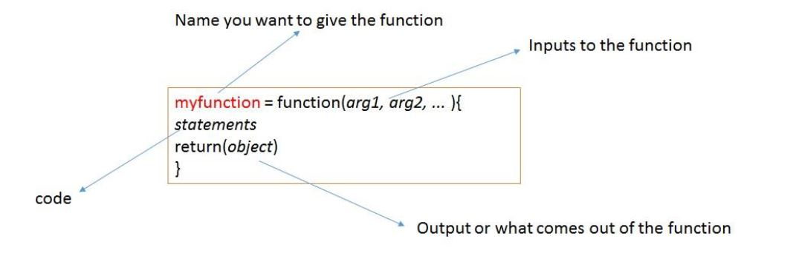

```{r setup, warning=FALSE,include=FALSE}
library(knitr)
knitr::opts_chunk$set(echo = TRUE)
results='markup' 
options(scipen = 999, digits = 4) #set to four decimal 

inline_hook <- function (x) {
  if (is.numeric(x)) {
    # ifelse does a vectorized comparison
    # If integer, print without decimal; otherwise print 4 places
    res <- ifelse(x == round(x),
      sprintf("%d", x),
      sprintf("%.4f", x)
    )
    paste(res, collapse = ", ")
  }
}
knit_hooks$set(inline = inline_hook)

```

# Functions

Thus far, we have used many functions available in base R as well as in packages
that we have explored. Examples of these functions include `mean()`, `std()`,
`integrate`, and others. You can create your own functions, as well. Let us do an example.

There is no function available in base R to compute geometric mean. Geometric 
mean of positive numbers $a_1$,$a_2$,...$a_n$ is defined as:  
$$(a_1\times a_2\times a_3...a_n)^{1/n}$$  
Now we will attempt to create a function ourselves. 
Before we do this, let us write the code to compute the geometric mean of a set
of numbers. 
```{r}
v = c(1,33,4,29,9,90)
gmean = (prod(v))^(1/length(v))
gmean
```

The above code works fine to compute the geometric mean. What we would like to 
do is package this into a function so it can be used repeatedly in this script
or others that we may write. 
This is the anatomy of a function:  


```{r}
geomean = function(v){
gmean = (prod(v))^(1/length(v))
return(gmean)
}
```

That is how you create a function! Once the function is created, you can send
any input as a vector and our function will calculate the answer. Here is an
example of how we call the function. 

```{r}
x = c(1,3,54,9,29,234,6,2,8,2456,2,8)
geomean(x)
```

As another example, let us compute the harmonic mean which is defined as:  

$${n}\over{{1\over{a_1}}+...+{1\over{a_n}}}$$

The following code will give us the harmonic mean. 
```{r}
d = c(2,4,63,6,3)
g = 1/d
hmean = length(d)/(sum(g))
hmean
```

Now, let us create a function for harmonic mean. 
```{r}
harmean = function(v){
  a = 1/v
  hmean = length(v)/(sum(a))
  return(hmean)
}
```

Now we will test both of the functions. 
```{r}
v = c(2,23,3456,1,4,6)
geomean(v)
harmean(v)
```

Let us try another example. Suppose we have a vector $v = [4,6,23,6,375,9]$ and 
we want to find how many elements of the vector are above a cutoff number, say 6. The
following code can be used to find this. 
```{r}
v = c(4,6,23,6,375,9)
cutoff = 6
vsub = v[v>cutoff]
vsub
length(vsub)
```

Next, let us package this into a function. You should notice that this function 
should have two inputs: the vector and the cutoff value. 

```{r}
vecsize = function(v,cutoff = 1){
  vsub = v[v>cutoff]
  return(length(vsub))
}
```

Let us see how this function works. 
```{r}
v = c(.2,5,2,.6,3,57,34,5)
vecsize(v,10)
```
You will notice that in the function, we have set a default cutoff value of 1
by using `cutoff = 1`. If you do not specify a cutoff value when using the
function, it defaults to 1. For example  
```{r}
vecsize(v)
```

Let us do another example. Suppose we have a vector 
$v = [2,2,6,3,546,2346,22,34,7,21,4]$ and we want to see all the elements between 
5 and 100. The following code can be used to find this.  
```{r}
vec1 = c(2,2,6,3,546,2346,22,34,7,21,4)
cutoff1 = 5
cutoff2 = 100 
vsub = vec1[vec1>cutoff1 & vec1<cutoff2]
vsub
```

Now, let us turn this into a function. 
```{r}
Intermediate = function(vec1, cutoff1, cutoff2){
  vsub = vec1[vec1>cutoff1 & vec1<cutoff2]
  return(vsub)
}
```

Let us see how this works. 
```{r}
vec1 = c(2,2,6,3,546,2346,22,34,7,21,4)
Intermediate(vec1,5,100)
```


# Conditional Statements
Conditional statements are very useful and are an important element to any 
programming language. There are three varieties of syntax for conditional 
statements in R:

1. `if (condition) {trueExpressions}` 
2. `ifelse (condition,trueExpressions,falseExpressions)` 
3. `if (condition){trueExpressions} else {falseExpressions}`  
      
    
Suppose we have a vector of numbers and we want to create another vector 
containing 0s and 1s. If the element in the first vector is 5 or above, we want 
to put a 1 for the corresponding element in the second vector. Otherwise, we
want to put a 0. The appropriate code in R is 
```{r}
v1 = c(2,36,83,2,5,7,2,9,3,12)
v2 = ifelse(v1>=5,1,0)
print(v2)
```

Let us do another example. In the `MASS` package, there is a data frame called 
`whiteside`. Let us take a look at it. 
```{r}
library(MASS)
head(whiteside)
```

Suppose we want to create a column in which temperatures below 5 are labeled 
cold and temperatures above 5 are labeled hot.  
```{r}
whiteside$hotcold = ifelse(whiteside$Temp<5,"cold","hot")
head(whiteside)
```

Next, let us create a summary table of average gas consumption when it is hot and 
cold, and with and without insulation. As before, we use the `aggregate()` 
function to summarize. 

```{r}
x = aggregate(whiteside$Gas,list(whiteside$Insul, whiteside$hotcold),mean)
x
```

It works well! As expected, gas consumption is high when it is cold and when 
there is no insulation. Notice that the column names are not very informative. 
The column names of a data frame can be changed using the `colnames()` function. 

```{r}
colnames(x)
colnames(x) = c("Insulation","Weather", "Average_Gas_Consumption")
x
```

# Looping

## For Loops

Looping or iterations is another key element of programming. The syntax is as 
follows:  

`for (var in seq) {statements}`    

It is common to use `i` as the variable in the sequence. The command `print` allows you to write things out from inside the loop. 

Let us try an example. Say that you want to print the numbers 1-10 using a loop. 

```{r}
for (i in 1:10)
{
  print(i)
}
```

Next, let us say you want to print the product of a term and the two terms before
it. The code would be as follows:
```{r}
for (i in 1:10)
{
  print(i*(i-1)*(i-2))
}
```

Now, let us say you want a vector that gives you the running sums the elements
in vector $v1 = [1,2,4,2,4,6,7,8,9,12,4,1,5,2]$. The code can be written as 
follows:

```{r}
v1 = c(1,4,5,2,4,6,7,8,9,12,4,1,5,2)
v2 = v1
for (i in 2:length(v1))
{
  v2[i]=v2[i-1]+v1[i]
}
v2
```

For the next example, we want to create a vector that gives you all the prime 
numbers between two integers of your choice. To do this, you will need to 
install the package `schoolmath`. 

```{r}
library(schoolmath)
ans = c()
a = 20
b = 30
for (i in a:b)
{
  if(is.prim(i)==TRUE){ans = c(ans,i)}
}
ans
```

## Avoiding Loops
Even though we wrote the above code using loops, we won't necessarily have to use 
loops in R. This is because R does vectorized calculations. This makes it easy 
to code without having to write loops many times. For example, when we did the 
sum of a vector, to add up all the numbers, we used `sum()`. In other programming 
languages which do not support vectorized calculations, you will have to write a loop
to calculate the sum of the numbers in a vector. In general, use vectorized 
calculations and try to avoid using loops. 

Now, we will rewrite the above code above without using a loop. 
```{r}
x = seq(20:30)
y = is.prim(x)
y
x[y]
```

If you compare the two chunks of code, you will see that writing the code 
without using loops is much simpler and more elegant. 


Now, suppose you have a vector $[a_1, a_2,...a_n]$ and you want to calculate the 
following:  
$$\sum_{i = 1}^{n-1} a_ia_{i+1}$$   

```{r}
total = 0
v = c(1,4,2,5,73,4,5)
for (i in 1:(length(v)-1))
{
  total = total + (v[i]*v[i+1]) 
}
total
```

Again, there is a clever way to calculate this total without using loops by 
creating vectors $v1 = [a_1, a_2...,a_{n-1}]$ and $v2 = [a_2, a_3, ...,a_n]$. The code is:  

```{r}
v1 = v[1:(length(v)-1)] 
v2 = v[2:length(v)]
total = sum(v1*v2) 
total
```

In some cases, you will have no option but to create a loop. Here is an example. 

Let us say you have a vector $v1 = [1,2,3,4,5]$ and you want a loop that flips 
the order of the elements in the vector. 

```{r}
v1 = c(72,3,57,2,8,24,7)
v2 = c()
n = length(v1)
for (i in 1:n)
{
  v2[i] = v1[n +1 - i]
}
v2
```


## While Loops
Another type of iteration is the `while` loop. The syntax in R is   
    `while(cond) expr`     
    
The while loop is used when you want to repeat a set of commands while a 
condition remains true.  

Suppose you have a starting integer value, let us say 19. Now suppose you want to 
find ten prime numbers that follow 19. For this, the `for` loop is not useful. 
The logic to create this is as follows. 

We will create one index called `i` that starts at 19 and will increment by 1 
at each iteration. We will create another index `primi` which starts at 0 and 
will increment by 1 if a prime number is found. The while loop will continue 
until `primi` reaches 10. 

```{r}
library(schoolmath)
startnumber = 300
numprimes = 3
i = startnumber + 1
primi = 0
primevec= c()
while (primi<numprimes)
{
  if(is.prim(i)==TRUE){
    primi = primi + 1
    primevec = c(primevec,i)
    }
  i = i +1
}
print(primevec)

```

Let us package this into a function. 

```{r}
nextprimes = function(startnumber, numprimes){
  primi = 0
  i = startnumber + 1
  primevec = c()
  while (primi<numprimes)
  {
    if(is.prim(i)==TRUE){
      primi = primi + 1
      primevec = c(primevec,i)
    }
  i = i +1
  }
  return(print(primevec))
}
```
 
Now, let us test the function. 

```{r}
nextprimes(3,3)
nextprimes(19,10)
nextprimes(9,3)
```


