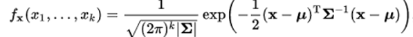
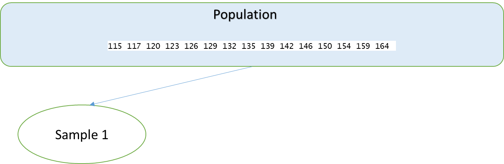
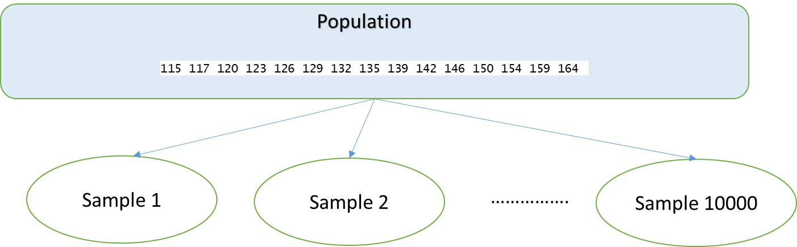

```{r setup, warning=FALSE,include=FALSE}
library(knitr)
knitr::opts_chunk$set(echo = TRUE)
results='markup' 
options(scipen = 999, digits = 4) #set to four decimal 

inline_hook <- function (x) {
  if (is.numeric(x)) {
    # ifelse does a vectorized comparison
    # If integer, print without decimal; otherwise print 4 places
    res <- ifelse(x == round(x),
      sprintf("%d", x),
      sprintf("%.4f", x)
    )
    paste(res, collapse = ", ")
  }
}
knit_hooks$set(inline = inline_hook)

```

# Multiple Distributions 

We will explore distributions of two events.The first distribution we are interested in is simply tossing a coin. The second distribution is to roll a die. Let us create empirical distributions for each 
of these. 

```{r}
set.seed(87654321)
coinsupport = c(0,1)
coinprob = c(.5,.5)
diesupport = seq(1,6)
dieprob = rep(1/6,6)

coinedf = sample(x = coinsupport, size = 10000, replace = T, prob = coinprob)
dieedf = sample(x = diesupport, size = 10000, replace = T, prob = dieprob)
```

Now that we have created these distributions empirically, let us take a look at
the empirical probabilities. 

```{r}
prop.table(table(coinedf))
```

```{r}
prop.table(table(dieedf))
```

Suppose we are interested in the following probabilities: the probability of 
getting a head, and the probability of rolling a 4. Based on the empirical
probabilities, we can write:   
$$P(coin = heads)= 0.4918$$
$$P(die = 4)=0.1650$$

Suppose the event we are interested in is the following: **we toss a coin first, and 
subsequently, we will roll a die**. 

What is the probability that we get a heads and a roll of 4? We can compute this
empirically. 

```{r}
prop.table(table(coinedf,dieedf))
```

From the above distribution, we can see that: 
$$P(coin = head \text{ and }  die = 4)= 0.0775$$

This is called the **joint probability** of heads and 4. How is this related to 
the individual probabilities of heads and 4? If the two events A and B are independent, 
we have 
$$P(A \text{ and } B) = P(A) \times P(B)$$

In our case, $P(coin = heads) = 0.4918$ and $P(die = 4) = 0.1650$. 

```{r}
0.4918 * 0.1650
```

These are fairly close given the magnitude of the data, indicating that these 
two events are independent. This makes sense, because flipping a coin has nothing 
to do with rolling a die. In other words, the outcome of one should not have any 
impact on the outcome of the other. 

Now, let us consider another example. Read the file called **Transactions** (you can download this file from the link at the bottom of the page). The data
set contains transactions of consumers. 0 indicates the item was not purchased, 
and 1 indicates it was purchased. 

```{r}
Transactions <- read.csv("../../data/Transactions.csv", stringsAsFactors=TRUE)
knitr::kable(Transactions[1:5,])
```

We are interested in two items: toothbrush and perfume. Let us compute the 
individual and joint probabilities of these two items. 

```{r}
prop.table(table(Transactions$Toothbrush))
```

```{r}
prop.table(table(Transactions$Perfume))
```

```{r}
prop.table(table(Transactions$Toothbrush, Transactions$Perfume))
```
 
We have `P(Toothbrush) = 0.07215` and `P(Perfume) = 0.09318`, and the joint 
probability is `P(Toothbrush AND Perfume) = 0.02324`. 

```{r}
.0721 * .09318
```

As you can see, `P(Toothbrush AND Perfume)` is significantly bigger than 
`P(Toothbrush) X P(Perfume)`. This means the purchase of a toothbrush
and perfume are not independent. We define the measure called **lift**. which 
is 
$$Lift = \frac{P(A \text{ and } B)}{P(A) \times P(B)}$$

In our case, 

```{r}
lift = 0.02324487/(.0721 * .09318)
lift
```

the lift value of 3.46 indicates there is a strong association between the 
purchase of these two items. The probability that the consumer would buy these
two together is 3.46 times more than if it were to occur randomly. 

# Univariate and Multivariate Distributions
All the univariate distributions we have discussed thus far, including normal, 
Poisson, exponential, have corresponding multivariate distributions. 

For example, the pdf for a multivariate normal distribution is the following: 

 

The mean and the variance are described in matrix forms. For example, a bivariate
normal distribution is specified as:

$$
N
\left(\begin{bmatrix}
\mu_1 \\
\mu_2\\
\end{bmatrix}
,
\begin{bmatrix}
\sigma_1^2 & \sigma_{12}^2\\
\sigma_{12}^2 & \sigma_2^2 \\
\end{bmatrix} \right)
$$

where $\sigma_{12}^2$ is the covariance between the two variables. 

Let us create some random data from the following bivariate normal distribution using the package $mvtnorm$.

$$
N
\left(\begin{bmatrix}
4 \\
10\\
\end{bmatrix}
,
\begin{bmatrix}
2 & 1\\
1 & 3 \\
\end{bmatrix} \right)
$$

Let us create ten random values. 

```{r}
library(mvtnorm)
M = c(4,10)
S = matrix(c(2,1,1,3), nrow = 2, ncol = 2)
x = rmvnorm(10,mean = M,sigma = S)
x
```

The correlation between the two in the sample is

```{r}
cor(x[,1],x[,2])

```

Now let us plot this bivariate distribution. The `MASS` package has a function
called `kde2d()` to create the density values, which can then be plotted with 
`persp()`. The two parameters `theta` and `phi` are used to specify the viewing 
angle. 

First, we will create 1000 random values from the bivariate distribution, and 
then plot the density of it. 

```{r}
library(MASS)
x = rmvnorm(1000,mean = M,sigma = S)
y = kde2d(x = x[,1], y = x[,2])
persp(y, col="green",theta = 30, phi = 30)
```

# Transformations and Convolutions 

Let us empirically create a uniform distribution. 

```{r}
u1 = runif(10000)
plot(density(u1))
```

What if we square the random numbers? Will the resulting distribution still be 
uniform?

```{r}
u2 = u1^2
plot(density(u2))
```

What if we take the square root?

```{r}
u3 = sqrt(u1)
plot(density(u3))
```

Once you transform a uniform random variable, it is no longer uniform. 

Let us take the exponential of a normal distribution. 

```{r}
n1 = rnorm(10000)
plot(density(n1))
```

```{r}
n2 = exp(n1)
plot(density(n2))
```

Taking the exponential of random normal variable changes the domain (to $[0,\infty]$)
and induces a right skew. This, in fact, is called a **lognormal** distribution. 
This is used to capture variables like income, which can only be positive, and 
often exhibits a right skew. Most people have lower incomes, with a few very rich 
people who create the skew in the income distribution. 

Now, let us ask the question of what happens if you keep adding 
a number of independent distributions. Let us see what the average of two 
uniform distributions looks like. 

```{r}
u4 = runif(10000)
u5 = runif(10000)
newdist = u4 + u5
plot(density(newdist))
```

Now let us add 3 more uniform distributions and 2 normal distributions
to this. 

```{r}
u6 = runif(10000)
u7 = runif(10000)
u8 = runif(10000)
e1 = rnorm(10000)
e2 = rnorm(10000)
newdist = newdist + u6 + u7 + u8 + e1 + e2
plot(density(newdist))
```

The result looks to be a normal distribution. This is a very important insight from 
the central limit theorem. 

# Sampling Distributions

Sampling distributions are important to conduct statistical testing. 

```{r}
women = read.csv("../../data/women.csv")
women
```

Let us assume that the `weight` of the women in the data frame constitutes the 
**entire population** of interest for us. Let us calculate the population mean and 
standard deviation. 

```{r}
popmean = mean(women$weight)
popsd = sd(women$weight)
paste("population mean = ", popmean)
paste("population standard deviation = ", popsd)
```

Suppose we want to do the following: from this population, we want to draw a 
sample of size 5. This is illustrated in the figure below. 




```{r}
set.seed(87654321)
s = sample(x = women$weight, size = 5, replace = F)
paste("sample mean = ", mean(s))
```

The sample mean is a bit different from the true population mean. A question 
that comes up naturally is how close or how far the sample mean can be from the true population mean. 

To get an idea, let us replicate this process of drawing a sample and computing 
the sample mean 10000 times. This is illustrated in the figure below. 



```{r}
f1 = function(){
  s = sample(x = women$weight, size = 5, replace = F)
  return(mean(s))
}
samplingdist = replicate(10000, f1())
```

Now let us find out how small or how large the mean can be from a sample. 

```{r}
paste("smallest sample mean = ", min(samplingdist))
paste("largest sample mean = ", max(samplingdist))
```

What if you take the mean of this distribution?

```{r}
paste("mean of the sampling distribution = ", mean(samplingdist))
```

It is very close to the true population mean! 

This is called the **sampling distribution**. Let us plot the sampling distribution. 

```{r}
plot(density(samplingdist))
abline(v = mean(samplingdist), col = "purple", lwd = 3)

```

Note that `lwd` specifies the line width. You will notice that the sampling 
distribution looks normal. 

This time, we will recreate this with the median of the sample as our 
statistic of interest. 

```{r}
f2 = function(){
  s2 = sample(x = women$weight, size = 5, replace = F)
  return(median(s2))
}
samplingdist2 = replicate(10000, f2())
```

Let us calculate the population median. 

```{r}
paste("population median = ", median(women$weight))
paste("mean of the sampling distribution = ", mean(samplingdist2))
```

Very close! Let us plot this. 

```{r}
plot(density(samplingdist2,bw = 2))
```

This is not really normal. Thus, the shape of the sampling distribution is normal only if our statistic of interest is the mean. No guarantees for other statistics of interest.  

Here is another example. Let us try to create the sampling distribution out of the following population distribution. 

Value|Probability
-----|-----------
1|.5
4|.1
15|.1
72|.3
-----------------

Let us create a sampling distribution of the mean when we draw samples from the 
above distribution of size = 100. 

```{r}
v = c(1,4,15,72)
p = c(.5,.1,.1,.3)
f3 = function(){
  s3 = sample(x = v, size = 100, replace = T, prob = p)
  return(mean(s3))
}
samplingdist3 = replicate(10000, f3())
plot(density(samplingdist3))
```

This looks very normal!

Now, let us do this with standard deviation as the statistic of interest. 

```{r}
v = c(1,4,15,72)
p = c(.5,.1,.1,.3)
f4 = function(){
  s4 = sample(x = v, size = 100, replace = T, prob = p)
  return(sd(s4))
}
samplingdist4 = replicate(10000, f4())
plot(density(samplingdist4))
```

When we changed the statistic from the mean to the standard deviation, the 
sampling distribution is no longer normal. Now, let us try median as the 
statistic of interest. 

```{r}
v = c(1,4,15,72)
p = c(.5,.1,.1,.3)
f5 = function(){
  s5 = sample(x = v, size = 100, replace = T, prob = p)
  return(median(s5))
}
samplingdist5 = replicate(10000, f5())
plot(density(samplingdist5))
```

Definitely not normal! 

The takeaway from this is that the only statistic which will create a normal 
sampling distribution is the mean. Other statistics may create distributions
that look far from normal. 

Sampling distributions form the foundation of how we conduct statistical testing. 
We will explore this in detail in the next lesson. For now, the important thing
to remember is that, before you can create a sampling distribution, you first need to describe your population. After that, you decide the **sample size** and the **statistic** you are interested in. Once you identify these, you can easily create the sampling distribution. 


# Use Case - Data Exploration

In this use case, we will explore and understand data which captures financial analytics for 94 industries, such as Air Transport, Utility (Water)and soon, in the US market. 


```{r}
df = read.csv("../../data/valuation multiples.csv")
df$EBITDA_margin = df$EBITDA....millions./df$Revenues....millions.

df$Net_Margin = df$Net.Income.....millions./df$Revenues....millions.

df$Debt_EV = df$Total.Debt..including.leases.....millions./df$Enteprise.Value....millions.

df$EBITDA_EV = df$EBITDA....millions./df$Enteprise.Value....millions. 

df$EBITDA_multiple = df$EBITDA....millions./df$Enteprise.Value....millions. 

library(corrgram)  

corrgram(df,upper.panel = panel.pts,lower.panel= panel.pie,order = T )
```

Now we can calculate some financial analytics that will help us understand the valuation of different industries and create the bivariate plots: 

```{r}
library(corrgram)
corrgram(df,upper.panel = panel.pts,lower.panel= panel.pie,order = T )
```

Examining the heat map, we can see how different financial analytics compare across industries. The lighter the color the higher the correlation between two data items. First note that the diagonal line, moving top-left to bottom right, is correlating with a variable against itself, so shows a perfect correlation. We are interested in the off-diagonal areas of the heat map.   We can see, for example, that Enterprise Value has a high correlation with Invested Capital (a light color), and a moderately high correlation with Gross profit, indicating that the more profitable a firm the higher the enterprise value. 

```{r}
heatmap(cor(df),Rowv = NA, Colv = NA)

```


