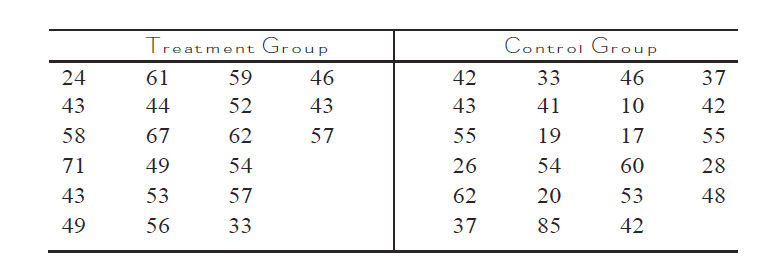

```{r setup, warning=FALSE,include=FALSE}
library(knitr)
knitr::opts_chunk$set(echo = TRUE)
results='markup' 
options(scipen = 999, digits = 4) #set to four decimal 

inline_hook <- function (x) {
  if (is.numeric(x)) {
    # ifelse does a vectorized comparison
    # If integer, print without decimal; otherwise print 4 places
    res <- ifelse(x == round(x),
      sprintf("%d", x),
      sprintf("%.4f", x)
    )
    paste(res, collapse = ", ")
  }
}
knit_hooks$set(inline = inline_hook)

```


# Load functions to compute p-value

```{r message=FALSE}
library(ggplot2)
p_rtail = function(sampdist,tstat)
  {
  temp = density(sampdist)
  df = data.frame(temp$x, temp$y)
  formula1 = df$temp.x<tstat
  df1 = df[formula1,] 
  plot(df, col = "red", type = "h")
  points(df1, col = "green", type = "h")
  pvalue = length(sampdist[sampdist>tstat])/(length(sampdist))
  return(pvalue)
  }

p_ltail = function(sampdist,tstat)
  {
  temp = density(sampdist)
  df = data.frame(temp$x, temp$y)
  formula1 = df$temp.x>tstat
  df1 = df[formula1,] 
  plot(df, col = "red", type = "h")
  points(df1, col = "green", type = "h")
  pvalue = length(sampdist[sampdist<tstat])/(length(sampdist))
  return(pvalue)
  }

p_2tail = function(sampdist,tstat)
  {
hyp = mean(sampdist)  
cutoff1 = hyp - abs(tstat-hyp)
  cutoff2 = hyp + abs(tstat-hyp)
  temp = density(sampdist)
  df = data.frame(temp$x, temp$y)
  formula1 = df$temp.x<cutoff1 | df$temp.x>cutoff2
  df1 = df[formula1,] 
  plot(df, col = "green", type = "h")
  points(df1, col = "red", type = "h")
  pvalue = length(sampdist[sampdist<cutoff1 |  sampdist>cutoff2])/(length(sampdist))
  return(pvalue)
  }

```

# Basic Concepts

In this lesson we will explore `Nonparametric statistical tests`, which rely on no or few assumptions about the population distribution from which the sample was drawn. 

# Median Test 

In a previous chapter, we conducted a test where the null hypothesis was that the
median GMAT score was 510. Let us replicate that code here. 

```{r}
admission <- read.csv("../../data/admission.csv", stringsAsFactors=TRUE)
set.seed(87654321)
sampsize = nrow(admission)
f1 = function(){
  s1 = rnorm(sampsize, mean = 500, sd = sd(admission$GMAT))
  return(median(s1))
}
sampdist = replicate(10000, f1())
plot(density(sampdist))

tstat = median(admission$GMAT)
tstat

gap = abs(tstat-500)
cutoff1 = 500 - gap
cutoff2 = 500 + gap
temp = density(sampdist)
df = data.frame(temp$x, temp$y)
formula1 = df$temp.x<cutoff1 | df$temp.x>cutoff2
df1 = df[formula1,] 
plot(df, col = "green", type = "h")
points(df1, col = "red", type = "h")
pvalue = length(sampdist[sampdist<cutoff1 | sampdist>cutoff2])/(length(sampdist))
print(pvalue)
```

Can we conduct this test without having to assume that the population 
distribution for GMAT scores is normal? 

We know that, regardless of what the population distribution is, by definition,
half of the values should lie below the median and half should lie above the median. 
This is true for a normal distribution and also true for any other distribution. We will use this basic logic to design our test. 

Parametric Population Description|Nonparametric Population Description 
---------------------------------|-------------------
Normal Distribution|Population consists of positives (1) which are above the median and negatives (0) which are below the median with equal probabilities 
-------------------------------------------------------------------------------------------

Now we can conduct the test. 

```{r}
set.seed(87654321)
sampsize = nrow(admission)
f1 = function(){
  s1 = sample(x = c(0,1), size = sampsize, replace = T, prob = c(.5,.5))
  return(sum(s1)/sampsize)
}
sampdist = replicate(10000, f1())
plot(density(sampdist))

tstat = length(admission$GMAT[admission$GMAT>500])/(sampsize)

gap = abs(tstat-.5)
cutoff1 = .5 - gap
cutoff2 = .5 + gap
temp = density(sampdist)
df = data.frame(temp$x, temp$y)
formula1 = df$temp.x<cutoff1 | df$temp.x>cutoff2
df1 = df[formula1,] 
plot(df, col = "green", type = "h")
points(df1, col = "red", type = "h")
pvalue = length(sampdist[sampdist<cutoff1 | sampdist>cutoff2])/(length(sampdist))
print(pvalue)

```


```{r}
tstat = length(admission$GMAT[admission$GMAT>510])/(sampsize)
p_2tail(sampdist,tstat)
```


Since the p value is 0.0076, we reject the null hypothesis. Conducting this test did not require us to specify the population distribution for the GMAT scores!


```{r}
set.seed(87654321)
sampsize = nrow(admission)
f1 = function(){
  s1 = sample(x = c(0,1), size = sampsize, replace = T, prob = c(.5,.5))
  r1 = seq(1:sampsize)
  x = sum(r1[s1==1])
  return(x)
}
sampdist = replicate(10000, f1())
plot(density(sampdist))

```

```{r}
sign_gmat = ifelse(admission$GMAT<510,0,1)
dev_gmat = abs(admission$GMAT-510)
df = data.frame(sign_gmat,dev_gmat)
df = df[order(df$dev_gmat),]
df$rank_gmat = seq(1:sampsize)
tstat = sum(df[df$sign_gmat==1,]$rank_gmat)
p_2tail(sampdist,tstat)
print(tstat)
```


```{r}
sum(df[df$sign_gmat==1,]$rank_gmat)
wilcox.test(x=admission$GMAT,mu = 510)
```


Let us do another one. 

# Two Sample Test 

Suppose you have the following data on reading scores of third graders. The treatment
group has been subjected to a special reading program. You want to test to see if 
the reading program is effective in improving the reading scores of third graders. 



Let us read and take a look at the data. 

```{r}
twosample <- read.csv("../../data/twosample.csv")
table(twosample$group)
```


**Step 1**: State the hypothesis.   
There is no difference in the mean of the treatment and control groups.    
**Step 2**: Describe the data generation process and the population.    
There is no difference between the two groups. We can pool them all into one
large group.   
**Step 3**: Create a sampling distribution.      
The sampling distribution is created with the following code.     

```{r}
set.seed(87654321)
f1 = function(){
  pool = twosample$score
  s1 = sample(pool)
  control1 = s1[1:23]
  treatment1 = s1[24:44]
  return(abs(mean(treatment1)-mean(control1)))
}
sampdist = replicate(10000, f1())
plot(density(sampdist))
```

**Step 4**: Get the actual sample and compute the statistic.   

```{r}
tstat = abs(mean(twosample$score[1:21]) - mean(twosample$score[22:44]))
p_rtail(sampdist,tstat)
```

**Step 5**: Plot and compute the p value. 

```{r}
cutoff = tstat
temp = density(sampdist)
df = data.frame(temp$x, temp$y)
formula1 = df$temp.x>cutoff
df1 = df[formula1,] 
plot(df, col = "green", type = "h")
points(df1, col = "red", type = "h")
pvalue = length(sampdist[sampdist>tstat])/(length(sampdist))
print(pvalue)
```

Since the p value is 0.0262, we reject the null hypothesis that there is no 
difference between the treatment and control groups. Remember again that we 
made no assumption about the distribution of the student scores. The same basic 
approach can be used to evaluate if the median or the 75% percentile scores 
improve with the special reading program. 

# Correlation Test

Now let us conduct a nonparametric test for the correlation between two numeric
variables. We do not want to assume any underlying population distribution for 
either of the two numeric variables. 

The basic logic is similar to the two sample test. If there is no correlation between the two variables, then high values in one are not associated with high values in the other if they are positively correlated (high and low for negative correlation). 

```{r}
immer = read.csv("../../data/immer.csv")
```

**Step 1**: State the hypothesis.   
There is no correlation between `Y1` and `Y2`.    
**Step 2**: Describe the data generation process and the population.    
Since there is no correlation, we can shuffle the vectors and find their correlation
to create a sampling distribution.   
**Step 3**: Create a sampling distribution.      
The sampling distribution is created with the following code.     

```{r}
set.seed(87654321)
f1 = function(){
  s1 = sample(immer$Y1)
  s2 = sample(immer$Y1)
  return(cor(x = s1,y = s2))
}
sampdist = replicate(10000, f1())
plot(density(sampdist))
```

**Step 4**: Get the actual sample and compute the statistic.   

```{r}
tstat = cor(immer$Y1, immer$Y2)
p_2tail(sampdist,tstat)
```

**Step 5**: Plot and compute the p value. 

```{r}
gap = abs(tstat-0)
cutoff1 = 0 - gap
cutoff2 = 0 + gap
temp = density(sampdist)
df = data.frame(temp$x, temp$y)
formula1 = df$temp.x<cutoff1 | df$temp.x>cutoff2
df1 = df[formula1,] 
plot(df, col = "green", type = "h")
points(df1, col = "red", type = "h")
pvalue = length(sampdist[sampdist<cutoff1 | sampdist>cutoff2])/(length(sampdist))
print(pvalue)
```

Therefore, we can reject the null hypothesis of no correlation between the two 
variables. 

# Bootstrapping

Bootstrapping is a very popular nonparametric technique to define population 
distributions. Let us first take a look at the Merriam-Webster dictionary definition of the term. Bootstrap is defined as **to promote or develop by initiative and
effort with little or no assistance**. Let us see how this works. 

Suppose we have the following sample of data. 

$\text{Observed number of complaints} = (4,3,5,13,7,10,9,9,3,6,4,3,7,10,7,6,7,8,7,7)$

```{r}
sample1 = c(4,3,5,13,7,10,9,9,3,6,4,3,7,10,7,6,7,8,7,7)
```

The bootstrapping approach works as follows.   

1. Since the sample came from the population, the sample is clearly part of the 
population.  

2. Bootstrapping assumes that the data we have are a reasonable representation of the
population from which they came and that other data from the population that we did
not collect will in fact look like the data we do have. If we do this repeatedly, our population will begin to emerge.   


Given this, we can create the sampling distribution by ‘taking samples from the one sample we have’. In other words, **we sample from the sample with replacement**. Once we have the bootstrap sampling distribution, we can use it to create confidence intervals and for hypothesis testing as well.

Let us create the bootstrap sampling distribution and calculate the 95% confidence interval for the variable `Y1` in the `immer` data frame.

```{r}
bootsampdist = replicate(10000, mean(sample(immer$Y1, replace = T)))

q2 = quantile(bootsampdist, c(.05/2,1-(.05/2)))
plot(density(bootsampdist))
abline(v = q2, col = "red")
paste("95% Confidence interval = [", round(q2,2)[1],", ",round(q2,2)[2],"]")
```

With the confidence interval defined, a null hypothesis which states that the population value is outside of the interval can be rejected. 

# Synthetic Data

```{r}
head(admission) 
```


```{r warning=FALSE}
library(synthpop)
s1 = syn(admission)
head(s1$syn)
```